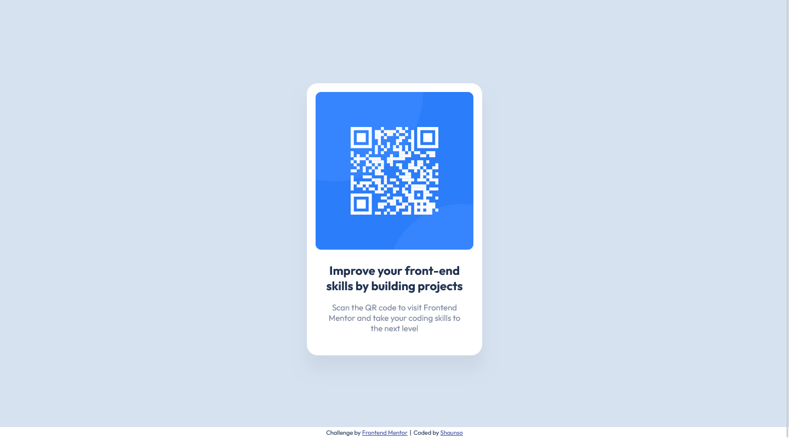

# Frontend Mentor - QR code component solution

This is a solution to the [QR code component challenge on Frontend Mentor](https://www.frontendmentor.io/challenges/qr-code-component-iux_sIO_H).

## Table of contents

- [Overview](#overview)
  - [Screenshot](#screenshot)
  - [Links](#links)
- [My process](#my-process)
  - [Built with](#built-with)
  - [What I learned](#what-i-learned)
  - [Continued development](#continued-development)
- [Author](#author)

## Overview

### Screenshot

[Desktop](./desktop-screenshot.png)
[Mobile](./mobile-screenshot.png)

### Links

- Solution URL: [Add solution URL here](https://your-solution-url.com)
- Live Site URL: [Add live site URL here](https://your-live-site-url.com)

## My process

### Built with

- Semantic HTML5 markup
- CSS custom properties
- Flexbox
- Mobile-first workflow

### What I learned

This was my second time attempting this challenge. First time I attempted this challenge, I had just completed the HTML5 & CSS3 courses on `https://www.w3schools.com/` and had not begun learning JavaScript.

This second attempt also acts as a benchmark for my understanding of  HTML5 & CSS3 as I was able to complete this challenge in circa. 2 hours.

I was able to complete this challenge with only needing to look up (i) semantic HTML5 and (ii) the 'background-image' CSS3 property.

This second attempt further bolsters my confidence in my journey as it is proof of my understanding of Web Development fundamentals.

### Continued development

Using CSS variables

## Author

- Github - [Shaunso](https://github.com/shaunso)
- Frontend Mentor - [@shaunso](https://www.frontendmentor.io/profile/yourusername)
